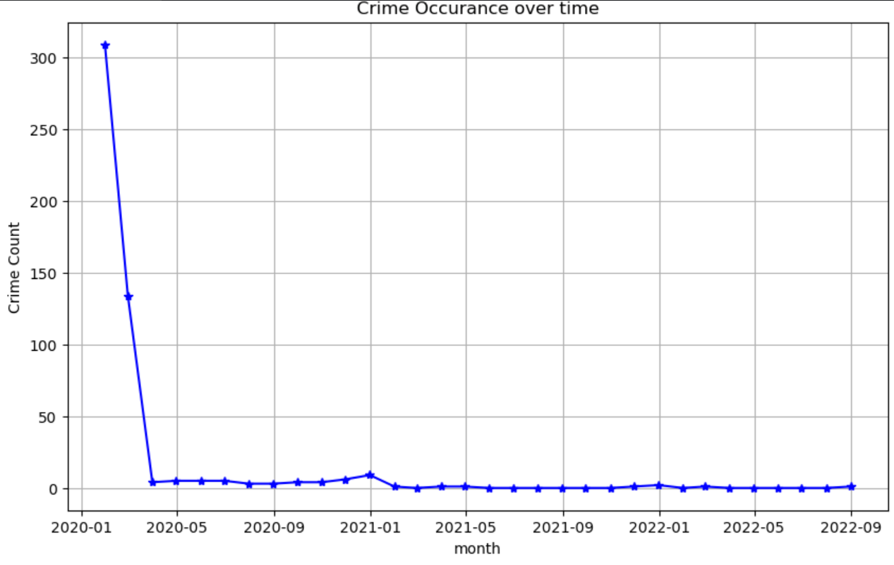
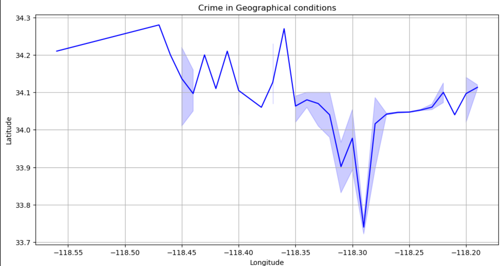

# Crime Data Analysis

## Portfolio Project | Data Analyst | Python | SQL | Data Visualization

---

## Project Overview

This project focuses on analyzing crime data to identify patterns, trends, and key insights using Python, SQL, and data visualization techniques. The objective is to understand crime frequency, locations, categories, and time-based trends to support data-driven decision-making.

---

## Objectives

* Clean and preprocess raw crime data
* Perform exploratory data analysis (EDA)
* Identify high-crime locations
* Find most common crime categories
* Analyze trends based on date and time
* Generate charts and visual insights
* Write SQL queries for problem statements

---

## Tools & Technologies Used

* Python
* Pandas
* NumPy
* Matplotlib
* Seaborn
* SQL
* Jupyter Notebook

---

## Dataset Information

The dataset contains crime-related records such as:

* Crime Type
* Date & Time
* Location
* Area
* Status
* Victim Details

---

## Key Analysis Performed

* Total crimes reported
* Most common crime categories
* Crime distribution by area
* Monthly / yearly crime trends
* Arrest status analysis
* Victim age and demographic insights

---

## Files in Repository

* `crime_data_analysis.ipynb` – Main analysis notebook
* `crime_data.csv` – Dataset used for analysis
* `images/` – Project charts and screenshots
* `README.md` – Project documentation

---

## Project Screenshots

### Crime Occurrence Over Time

### Common Crimes Based on Crime Code

### Crime in Geographical Conditions

---

## Key Insights

* Certain crime categories occur more frequently than others
* Some areas show higher crime rates
* Crime trends vary across time periods
* Data can support better law enforcement planning

---

## Future Improvements

* Build interactive dashboard using Power BI / Tableau
* Deploy web dashboard using Streamlit
* Apply Machine Learning for crime prediction
* Real-time crime monitoring system

---

## Author

**Swathi Dasari**

---

## GitHub Repository

Capstone Project - Crime Data Analysis

